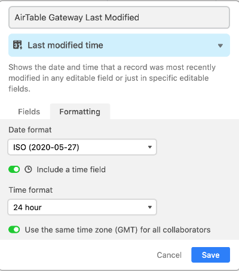
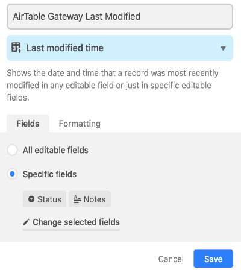
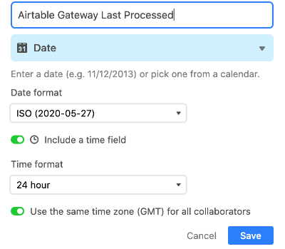
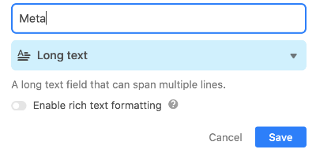

# Airtable Gateway deployment guide

We at MANYC are presently only supporting [paid Heroku dynos](https://www.heroku.com/pricing).
This project is an 'active' server that actively polls your airtable every 10 seconds. Unfortunately  the free Heroku tier won't let you poll for any period of time before the free Heroku dyno goes to [sleep](https://devcenter.heroku.com/articles/free-dyno-hours#dyno-sleeping)

We hope in the future to have FULL deployment instructions on alternative platforms.

Should you wish to **_test_** Airtable Gateway in a non-production scenario, follow the [Deploy to Heroku](#deploy-to-heroku) steps skipping the final steps (10-13) then follow the [additional steps](#additional-directions-for-a-non-production-free-dyno-to-test-with) after the main deployment instructions.

## Deploy to Heroku

Follow the steps below, but here is a video, with covering the first 9 steps if you get stuck: [How to deploy Airtable Gateway to Heroku](https://youtu.be/LHQ_xRf9Uc8). After you watch, resume with step 10.

1. Contact MANYC to obtain three pieces of information:
   1. MANYC New Request URL
   2. MANYC Update Request URL
   3. MANY Delete Request URL
2. Add to your list of statuses a status 'Recalled' this will be used when MANYC triggers a cancel of a request.
3. Click this button, and continue reading.
   
4. Give your app a unique Heroku name, the name itself doesn't have an effect.
5. Choose the 'App Owner'
6. For region, 'United States' is sufficient.
7. Next up we have a quantity of 'Config Vars' to fill in. These are in alphabetical order. I will briefly describe them by their prefixes.
   1. AIRTABLE_
      1. These are 3 variables that will grant the app access to the correct Airtable base and table.
   2. FIELD_MAP_
      1. These are a series of variables where you map YOUR table fields to a standard that MANYC created. In most cases you should have fields already representing the data requested. A couple you may need to create and implement. But as always the naming (and visibility) is YOUR choice!
   3. MANYC_
      1. These three variables represent what you received from MANYC in step 1.
   4. POLL_FIELD_
      1. These three fields need to be created in the table you are syncing. They are for programmatic use only and therefore can, and should, be hidden from table views. As always the naming is your choice but we pre-filled the variables with suggested default names. The setup for the fields are very specific and ALL ARE NECESSARY.
      * POLL_FIELD_LAST_MODIFIED
         1. This field represents when the last time the record was modified in such a way that should trigger an update to MANYC
         2. Create the field with the following settings (using the naming of your choice)
            * 
         3. In the same area, click `Fields` and select the fields that'll trigger an update to MANYC. In the following example, only when there is a Status update OR a Notes update will MANYC get an update of the record.
            * 
      * POLL_FIELD_LAST_PROCESSED
         1. This field represents when the last time the record was scanned by Airtable Gateway.
         2. Create the field with the following settings
            * 
      * POLL_FIELD_META
         1. This field represents the status of all the fields of the record at time of the last scan of the record.
         2. Create the field with the following settings
            * 
   5. STATUS_MAP_
      1. There are THIRTY (yeah I know!) fields here that represent status mapping. But thankfully only 3 are required.
      2. These represent a mapping of your various statuses to the three generic status that MANYC utilizes.
         1. Just Can't
         2. Assigned
         3. Completed
      3. There needs to be at least 1 status that matches each of the three generic statuses. If you have MORE than 10 status to map to a given status, contact MANYC and we'll provide further instructions.
8. Click `Deploy app.` Reminder this is creating a free Heroku dyno.
9. When deployment is done, click `Manage App`
10. Click `Resources` on top
11. Click `Change Dyno Type`
12. Choose `Hobby` dyno, our app doesn't need a more powerful system.
13. You are all done!

## Additional directions for a non-production free dyno to test with

These instructions resume from step 9 of the deployment having clicked `Manage App`

1. Click `Settings` on top
2. In the 'Config Vars' section, click `Reveal Config Vars`
3. Scroll down to the last revealed one
   1. Set the key to: `FREE_HEROKU_DYNO`
   2. Set the value to: `true`
   3. Click `Add`
4. Click `Resources` on top
5. In the 'Add-ons' section use the search box to search for and click `Heroku Scheduler`
6. After you've read the Terms of Service, click `Provision`
7. In the 'Add-ons' section, a new link for `Heroku Scheduler` appeared, click it.
8. In the new tab, click `Create job`
9. Set the interval to every 10 minutes
10. Set the run command to `node src/jobs/pollOnce.js`
11. On bottom of the page, click `Save job`
12. You are all done!
