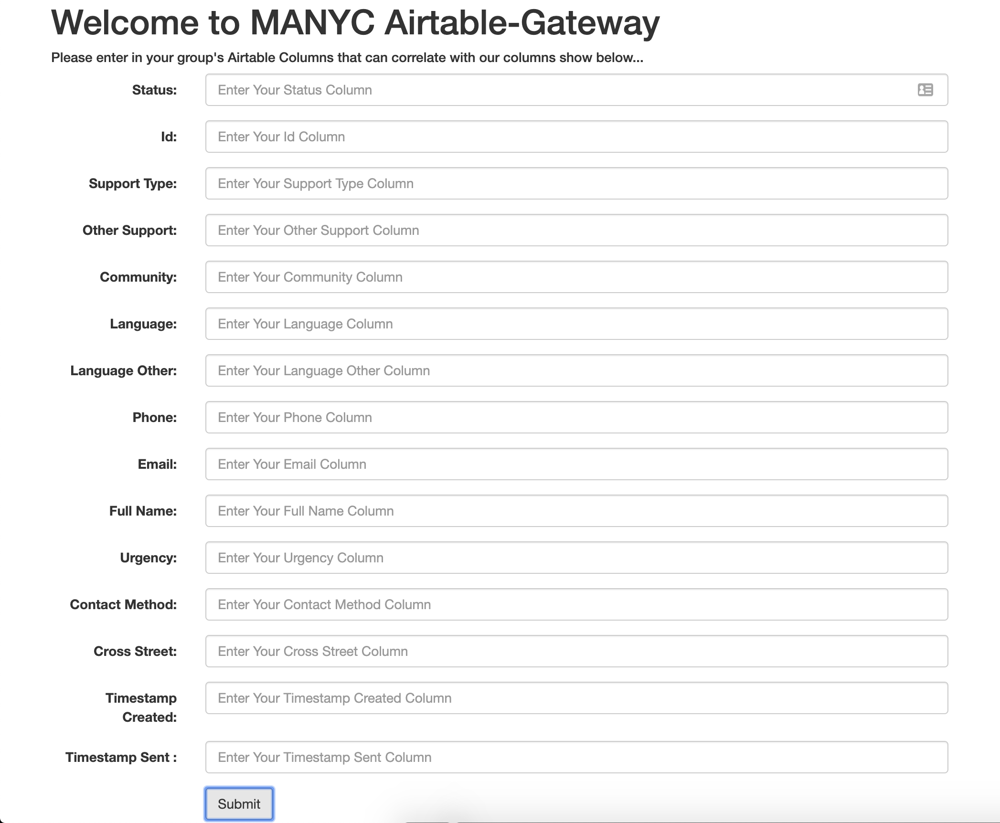

# Airtable Gateway

## Overview

> Note: This project is in it's early stages and this doc will be frequently evolving

The goal of this project is to create a simple way for client Mutual Aid groups to setup a two-way data connection between their own data hosted wherever (Airtable, Google Sheets, etc.) and the MANYC data system (currently heavily using [Integromat](https://www.integromat.com/)).

### Stage 1 - Client Setup (Need to nail down which parts we want to allow customization for)
The vision currently is to allow the client Mutual Aid group to be able to easily setup in 2 stages:

1. Heroku Enviroments Variables
2. Client Group Mapping Form

The first configuration stage occurs before deployment on Heroku. The client group will have to fill out required environment variables (Ex. Client Group's Airtable API Key). This will be used for crucial but sentitive data like API Keys, Authentication Tokens, etc.

The second configuration stage is for more custom information, and will be able to be entered through forms hosted directly on the application. If you visit the deployed heroku endpoint, it will direct to a form that will create a POST to enter the client mapping data into the application.

### Stage 2 - Airtable Polling
With the client setup with their own environment variables + column mapping, we can then poll their needs request table for updates using the [airtable-change-detector](https://github.com/crownheightsaid/airtable-change-detector) package from [Crown Heights Mutual Aid](https://github.com/crownheightsaid). Please see example usage [here](https://github.com/crownheightsaid/airtable-change-detector/blob/master/README.md).

When the airtable is polled and changed records are detected, we should make a POST request to the MANYC integromat webhook (setup for that is TBD).

### Stage 3 - Receiving Upstream Airtable Changes
Additionally we want to be able to send back changes to the client Airtable from the larger MANYC Airtable. The flow for this would be MANYC sending a POST request through Integromat to a REST endpoint setup on the gateway. This REST endpoint will then update / insert the row received using the Airtable API.

## Contributing
If you want to help with your own contributions to this project, please get started at our Contributions Doc [here](CONTRIBUTING.md)!

## Development setup
1. Copy `.env-sample` to `.env` (.env is git ignored)
   - `$ cp .env-sample .env`
2. Replace the values on the right side of the '=' in your new `.env` file
   - This file is git ignored
3. NPM install

